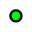
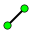
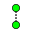
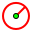
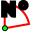
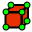
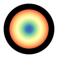

===========================
Getting started with Potree
===========================

This will cover how to create a simple template for navigating point cloud on a Potree environment.

Examples of potree templates:

* **Standard template**: basic structure of a Potree viewer with the possibilities to integrates functionalities for annotations, oriented images and more.
* **Cultural Heritage template**: example of an updated and custom Potree viewer that enrich the basic functionalities with tools for better exploring 3D products in the field of Cultural Heritage.

Viewer controls
-----------------

* *Double Click* - Sets center of rotation and zooms into that point
* *Left Mouse Press* - Pan the view
* *Middle Scroll Wheel* - Zooms in and out
* *Right Mouse Press* - Rotate the view around the center point
* *Left Mouse Press (Pressing Ctrl)* - Rotate the view base on the camera position

User Interface
--------------

Appearance
++++++++++

**Point Budget Slider**

The point budget limits the number of points loaded and rendered at any given time, which helps to adapt performance requirements to the capabilities of different hardware. It gives you a complete version of point clouds.

Potree Viewer will save the previous selected point budget as the default point budget when the viewer is loaded next time.

**Field of View**

To control viewable range of point clouds elements to be included within the scene, the field of view can be adjusted. Default value is set to 55 degrees. The field of view will determine how much of the pointcloud you can see in your screen.

**Eye Dome-lightning**

The Potree Point Cloud viewer module can implement eye dome-lighting, a lighting model that highlights the shapes of objects.

Eye Dome-lighting group objects, shade their outlines and enhances depth perception in scientific visualization images.

It is useful for recognition and measurement of structures within pointcloud. It can be modified by adjusting Radius, Strength, and Opacity.Those are set to give you tight controls of movement with in the model.

By default, Eye Dome-Lighting is enabled on Potree viewer, but it can be disabled by clicking on the enable option.

**Background**

Potree viewer background can be modified with following available options:

* Skybox
* Gradient
* Black and white

**Splat Quality**

Standard/High quality are two different splat method which will give you the different viewing experience on your computer. Choose the one that works better for you.

* Min node size - impacts the point density of the nodes represented.
* Box - Displays the boxes of the nodes.
* Lock view - Lock the point cloud view, preventing to load or unload points to the model.

Measurements
+++++++++++++

Potree Viewer provides several tools for measurement. This tool set consist of 12 elements. It also has controls for showing or hiding the resulting measurement labels.

Measurements are performed by use of left clicking the mouse on the desired points and right clicking is needed to terminate the process.

**Angle**

..
    add image

.. image:: img/icons/angle.png

This tool measures the tridimensional angle formed by the lines connecting three points. To start a measurement, click on the angle measurement icon, then left click on three desired position and the process will be automatically completed.The unit of angle measurement is degree.

All red points are draggable to adjust their positions.

**Point**

..
    add image

This tool set a point at desired position and display its XYZ coordinate. To start a measurement, click on the point measurement icon, then click on the desired position and the process will be completed. All red points are draggable to adjust their positions.

**Distance**

..
    add image

This tool measures the tridimensional distance of the lines connecting a series of points. To start a measurement, click on the distance measurement icon and start clicking on the desired position (two or more). Right click to complete the measurement process. The unit of distance measurement is meter.

Further information such as total length can also be obtained from selecting this under the scene section in the sidebar. All red points are draggable to adjust their positions.

**Height**

..
    add image

This tool measures the vertical distance between two points. To start a measurement, click on the height measurement icon and then click on the desired two positions. The process will be automatically completed. More information can also be obtained from selecting this element under the scene section in the sidebar.

All red points are draggable to adjust their positions.

**Circle**

..
    add image

This tool measures the radius of a circle formed by three points. To start a measurement, click on the circle measurement icon and then click on three desired positions.The process will be automatically completed. All red points are draggable to adjust their positions.

More information such as Circumference can also be obtained from selecting this element under the scene section in the sidebar.

**Azimuth**

..
    add image

This tool measures the azimuthal angle of a line. This line is formed by two points selected by the user, the angle is measured in degrees, clockwise from 0 to 360 and starting from the geographical north. To start a measurement, click on the azimuth icon and then click the first position for the center point, then click the second position to complete the measurement.

More information can also be obtained from selecting this element under the scene section.

**Area**

..
    add image

.. image:: img/icons/area.png

This tool measures the horizontal area formed by a polygon. To start a measurement, click on the area icon and start clicking on the positions forming the desired polygon (three or more).

Right click to finish measurement.

Further information can also be obtained from selecting this element under the scene section.

**Volume (cube)**

..
    add image

This tool measures the horizontal area formed by a cube. To start a meaurement, click on the volume(cube) icon and click on the desired position in pointcloud to place the cube.

It is possible to relocate, rescale and rotate the cube using the displayed handlers. click the eye icons on the cube can view cube from the angle normal to the plane.

Right click to finish the measurement.

More information can also be obtained from selecting this element under the scene section.

**Volume (sphere)**

..
    add image

This tool measures the volume formed by a sphere. To start a measurement, click on the volume (sphere) icon and click on the desired position in point cloud to place the sphere. It is possible to relocate, rescale and rotate the sphere using the displayed handlers.

Right click to finish measurement.

Further information can also be obtained from selecting this element under the scene section.

**Height profile**

..
    add image

The tool icon looks like a multicolored M.

This tool creates a height profile formed by a line on the point cloud. To start a measurement, click on the Height profile icon and then form a line on the pointcloud by clicking on the desired points (two or more).

When you mouse over the point cloud data, you should now see a red ball attached to your mouse cursor. This allows you to drop nodes and establish the location of your profile.

When you want to finalize your profile double click on the last node. Once a profile is finalized, you can still change its location by clicking on the red nodes and dragging them to a different location.

Further information and options, such as Show 2d Profile, can also been obtained from selecting this element under the scene section.

A profile of the lidar data should now be visible at the bottom of the screen. The profile will also update in real time if you move the profile throughout the data.

The save button in the upper right corner of the profile window will download a las file(3D) containing the points from the profile or a CSV file(2D) containing the metadata of points.

This is useful for extracting the data you want to use for further analysis.

**Annotation**

..
    add image

This tool creates an annotation label on a highlighted point on the pointcloud. To label a new annotation, click on the annotation icon and then click on the desired position.

To edit the annotation, select this element under the scene section, then edit Title and Description.

Clicking to the annotation can zoom to the annotation.

**Remove all measurement**

..
    add image

This tool removes all measurements on the pointcloud. To remove all measurement, click on the Remove all measurements icon or press Escape on the keyboard.

Clipping
++++++++

..
    add image

.. image:: img/icons/clip_volume.png

Point cloud can be clipped by selecting an area. Clipping options include None / Highlight / Inside /outside.

To clip a point cloud, click on the volume clip icon, place the cube on the model and relocate, rescale, and rotate to contain the desired area. Highlight is set by default as the clipping method.

If only the points contained within the cube needs to be displayed, click on “Inside”, otherwise click on “Outside”.

To remove the clipping volume or polygons click on the Remove all clipping volumes icon.

Navigation
++++++++++

The default navigation mode is Earth control. Potree viewer will always save the previous selected navigation mode as the default navigation mode when the viewer is loaded next time.

**Earth Control**

..
    add image

Earth control navigated as anchored to the pointcloud. Mouse left button pans the pointcloud, mouse wheel controls zoom, and right button orbits the pointcloud.

Pressing “Ctrl”, key and holding the left mouse button changes the direction of the view.

**Fly Control**

..
    add image

.. image:: img/icons/fps_controls.png

Fly control moves the view as in a bird eyes using the keyboard. Keys “W” and “S” moves forward and backwards, respectively and in the direction of the view, while “A” and “D” moves left and right respectively.

Also, the “R” and “F” keys moves the view up and down. The mouse left button changes the direction of the view, mouse wheel controls the speed for these movements and right button moves the view in the XYZ axis.

**Helicopter Control**

..
    add image

Helicopter control moves the view as in an aircraft using the keyboard. Keys “W” and “S” moves forward and backwards, respectively restricted in a horizontal plane, while “A” and “D” moves left and right respectively.

Also, the “R” and “F” keys moves the view up and down. The mouse left button changes the direction of the camera, mouse wheel controls the speed for these movements, and right button moves the model in the XY axis.

**Orbit Control**

..
    add image

Orbit Control is similar to earthcontrol. The mouse left button orbits the model, the wheel controls zoom, and the right button moves the model in the XYZ axis.

**Full extent**

..
    add image

Full extent button restores all pointcloud view.

**Navigation cube**

..
    add image

Navigation cube displays a wireframe cube from different direction. Click the icon to view pointcloud from the specific direction.

**Compass**

Compass button displays/hides a compass on the upper right corner.

Scene 
++++++

The Scene section displays a file tree containing all the scene elements. Elements are arranged in six groups, which are Point clouds / Measurements / Annotations / Other / Vector / Images.

Each element within these groups have subtrees that can be selected to get more information and control its properties.

